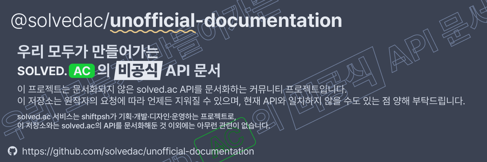

# Contributing



저장소에 기여할 때, GitHub 이슈를 통해 변경점에 관해 토론해주세요. 이후, Pull Request를 만들어주시면 감사하겠습니다.

## 문서 작성 방법

API를 문서화하기 위해서는 paths/나 schemas/ 아래 파일을 수정·추가하면 됩니다. 문서 안에서 말투는 기본적으로 하십시오체를 사용하며, `paths` 내부 `summary`는 -하기로 끝냅니다. 내용을 작성할 때에는 간결하고 알아듣기 쉽게 작성하도록 합니다.

### 개발 서버 가동

프로젝트 루트 폴더 속 정적 파일을 HTTP로 제공하면 됩니다. 그 방법은 여러가지가 있을 수 있으나, 여기서는 다음 방법만 설명하도록 합니다.

#### (npm/yarn) servor 이용

1. serve를 설치하세요.

    ```sh
    npm install -g servor
    yarn global add servor
    ```

2. 프로젝트 루트 폴더에서 다음 명령어를 실행하세요.

    ```sh
    servor --reload
    ```

## Pull Request 절차

- 한 명 이상의 개발자가 합병되기에 합당한지 평가합니다.
- PR이 합병되기에 합당하다면 버전 수정을 요구하는 코멘트가 달립니다. 버전 포맷은 `(solved.ac API 버전).(현재 년도).(현재 월)+b(해당 달 수정 횟수)`입니다. 알맞게 수정해주세요.

## 행동 강령

모든 기여자들이 환영, 존중받는다고 느낄 수 있도록, 기본적인 행동 강령을 정하고자 합니다. 다만, 너무나 많은 규칙은 외우기 힘들기 때문에 다음 규칙 하나를 중심으로 행동하기로 합니다.

> 인간으로서, 기본적으로 지켜야 할 예의을 지키기

물론, 위 문장이 모호하고 때때로 다르게 해석할 수도 있습니다. 따라서, 특히 다음과 같은 사항을 지켜야 함을 추가로 안내하고자 합니다.

- 열린 마음으로 다른 이들을 받아들이기
- 정중한 어투로 대화하기
- 다른 사람들을 존중하기
- 남을 비난하거나 욕하지 않기

이 외에는 서로 상처받지 않게, 조율할 수 있으면 좋겠습니다. 감사합니다.
