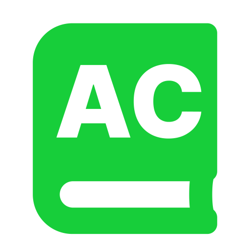
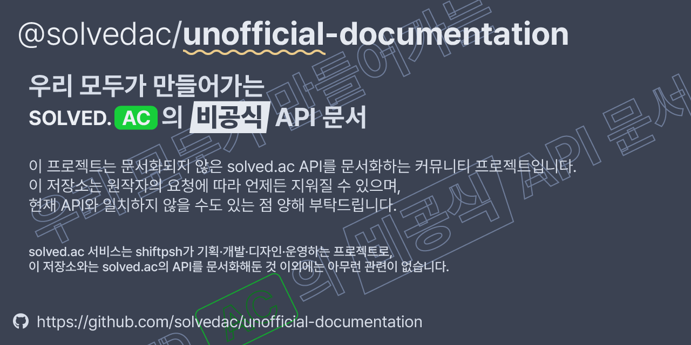
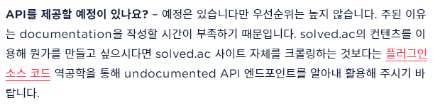

#  @solvedac/<ins>unofficial</ins>-documentation

> [접속하기](https://solvedac.github.io/unofficial-documentation)

이 프로젝트는 [solved.ac](https://solved.ac/) API를 문서화하는 커뮤니티 프로젝트입니다. 이 저장소는 원작자의 요청에 따라 언제든 지워질 수 있으며, 현재 API와 일치하지 않을 수도 있는 점 양해 부탁드립니다.

solved.ac 서비스는 shiftpsh가 기획·개발·디자인·운영하는 프로젝트로, 이 저장소와는 solved.ac의 API를 문서화해둔 것 이외에는 아무런 관련이 없습니다.

**주의**: (2023/03/08~) CORS 문제로 인해 API는 사이트 내에서 호출할 수 없으므로 별도 도구를 이용해주십시오. ([#51](https://github.com/solvedac/unofficial-documentation/issues/51))

## 기여하기

[CONTRIBUTING.md](CONTRIBUTING.md)를 참조해주세요.

### shiftpsh 님의 시간을 아낍시다

- [solved.ac 화이트리스트 관련 입장 (5/8)](https://blog.shift.moe/2020/05/08/solved-ac-%ed%99%94%ec%9d%b4%ed%8a%b8%eb%a6%ac%ec%8a%a4%ed%8a%b8-%ea%b4%80%eb%a0%a8-%ec%9e%85%ec%9e%a5-5-8/), 2020/05/08, Shifted
